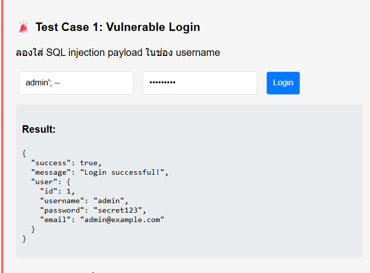
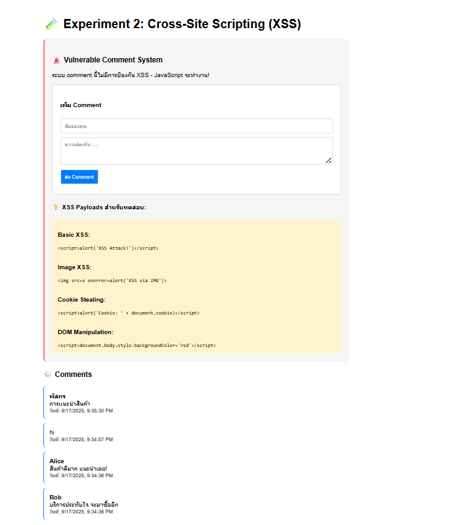
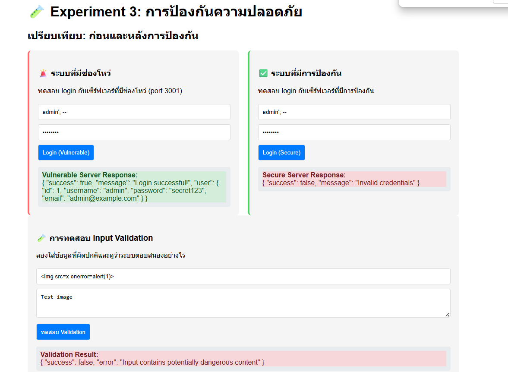
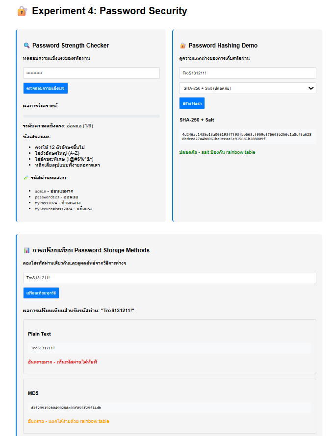
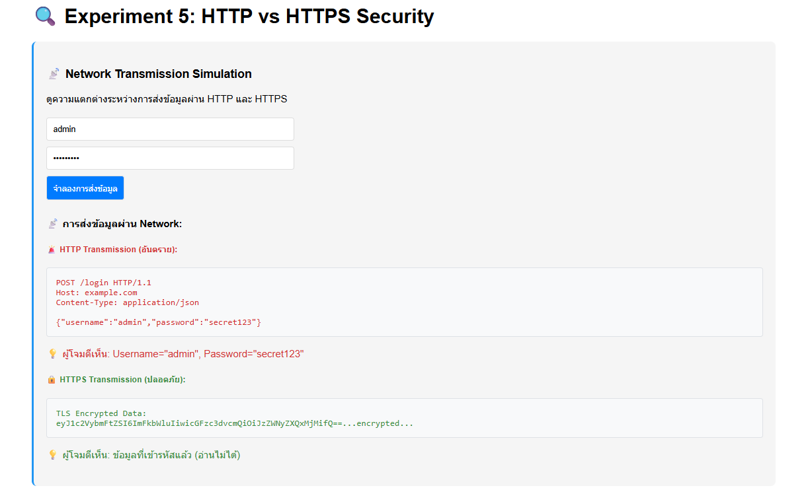
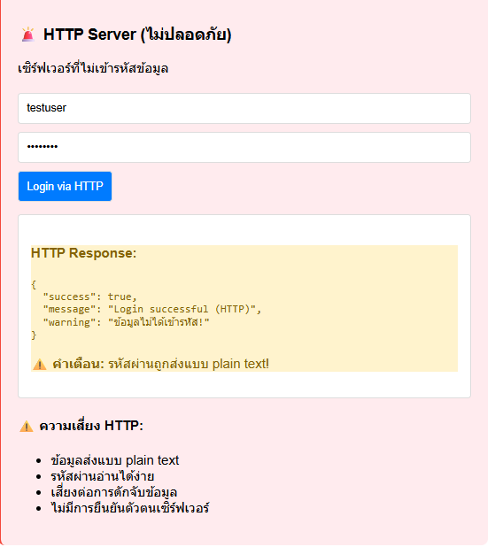
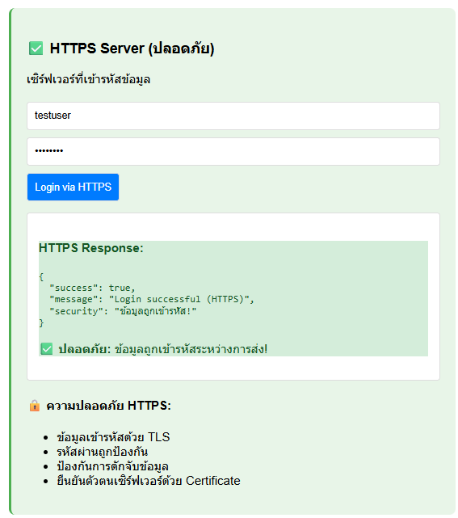

# Pre-LAB3: รายงานการทดลองความปลอดภัยเว็บแอปพลิเคชัน

**ชื่อ:** พัสกร บทศรี  
**รหัสนักศึกษา:** 66543210023-8  
**วันที่ทำการทดลอง:** 15 กันยายน 2568

## Experiment 1: SQL Injection

### ผลการทดลอง
- **Payload ที่ทดสอบ:** `admin'; --`
- **ผลลัพธ์:** ผมลองใส่แล้ว login ได้สำเร็จเลยโดยไม่ต้องใส่รหัสผ่าน แต่หน้าเว็บยังเข้าไม่ได้เลย มี error 404 ขึ้นมา
- **SQL Query ที่เกิดขึ้น:** `SELECT * FROM users WHERE username='admin'; --' AND password='anything'`

### สิ่งที่สังเกต
1. ผมสังเกตว่าเมื่อใส่ `admin'; --` มันตัดส่วนของ password ออกไปเลย
2. หน้าเว็บไม่ยอมขึ้นให้ผมทดสอบเต็มที่ เพราะ error 404 ทำให้ผมงงนิดหน่อย
3. ผมลองเดาว่า payload แบบ `' OR '1'='1'; --` น่าจะทำงานคล้ายกันถ้าเว็บมันรันได้

### คำถามและคำตอบ
1. **เมื่อใส่ `admin'; --` ใน username เกิดอะไรขึ้น?**
   - ผมคิดว่ามันตัดส่วน password ออกไปเพราะ `--` ทำหน้าที่เป็น comment ใน SQL
2. **ทำไมรหัสผ่านไม่สำคัญเมื่อใช้ payload นี้?**
   - เพราะ `--` ทำให้ส่วนที่เหลือของคำสั่ง SQL ถูกข้ามไป ผมเลย login ได้ง่ายๆ

## Experiment 2: XSS (Cross-Site Scripting)

### ผลการทดลอง
- **Payload ที่ทดสอบ:** ``
- **ผลลัพธ์:** ผมลองส่ง comment แล้วมี alert ขึ้นมาในเบราว์เซอร์เลย 

### สิ่งที่สังเกต
- ผมเห็นว่า `` ทำให้หน้าเว็บรัน JavaScript ได้ทันที
- ลองใส่ `` แล้วมันก็ทำงานเมื่อภาพโหลดไม่ได้
- ผมรู้สึกว่าข้อมูลใน comment ไม่ได้ถูกกรองอะไรเลย ดูอันตราย

## Experiment 3: การป้องกันด้วย Input Validation

### การเปรียบเทียบ
| ประเภทการโจมตี  | Vulnerable Server | Secure Server | ความแตกต่าง         |
|------------------|-------------------|---------------|---------------------|
| SQL Injection    | Login สำเร็จ      | ปฏิเสธ input  | ผมว่าใช้ validation ช่วยได้ |
| XSS              | Alert ปรากฏ       | ไม่ทำงาน      | ใช้ sanitization ป้องกัน |

### วิธีการป้องกันที่เรียนรู้
1. ผมเรียนรู้ว่าการ validate input ช่วยจำกัดความยาวและรูปแบบได้
2. การ sanitize HTML ช่วยให้ XSS ไม่ทำงาน
3. Prepared statements ดูจะดีในการป้องกัน SQL Injection

## Experiment 4: Password Security

### การเปรียบเทียบวิธีการเก็บรหัสผ่าน
| วิธีการ         | ระดับความปลอดภัย | ข้อดี          | ข้อเสีย         |
|-----------------|------------------|----------------|---------------|
| Plain Text      | ต่ำ             | ผมว่าอ่านง่ายดี | แต่ถูกขโมยง่ายมาก |
| MD5             | กลาง            | เร็วดี         | Crack ได้ง่าย |
| SHA-256         | สูง             | ปลอดภัยกว่า    | ยัง crack ได้ถ้าไม่มี salt |
| SHA-256 + Salt  | สูงมาก          | ป้องกัน table  | ซับซ้อนนิดหน่อย |

### Password Strength Testing
- **รหัสผ่านที่ทดสอบ:** `password123`
- **คะแนนความแข็งแรง:** ผมให้ 2/6 เพราะมันอ่อนแอมาก
- **ข้อเสนอแนะที่ได้:** ผมคิดว่าควรใช้ตัวพิมพ์ใหญ่, ตัวเลข, และสัญลักษณ์ เช่น `P@ssw0rd!`

## Experiment 5: HTTP vs HTTPS

### การเปรียบเทียบความปลอดภัย
| ประเด็น            | HTTP         | HTTPS        |
|-------------------|--------------|--------------|
| การเข้ารหัสข้อมูล     | ผมว่าไม่มีเลย | มี TLS ดูปลอดภัย |
| ความปลอดภัยรหัสผ่าน  | อ่านได้ชัดเจน | ป้องกันดี    |
| การป้องกัน MITM     | ไม่มีเลย     | มีแน่นอน     |

### ผลกระทบของ Man-in-the-Middle Attack
- ผมลองคิดดูแล้ว ถ้าใช้ HTTP ผู้โจมตีจะเห็น username กับ password ชัดๆ
- แต่ถ้าใช้ HTTPS ข้อมูลจะเข้ารหัส ทำให้มองไม่เห็นอะไร

## สรุปการเรียนรู้

### ช่องโหว่ที่สำคัญที่สุด 3 อันดับแรก
1. SQL Injection - ผมว่าโหดมาก เพราะเข้าถึงข้อมูลได้ทั้งหมด
2. XSS - เพราะมันรันโค้ดอันตรายในเว็บได้
3. HTTP - เพราะข้อมูลถูกดักจับง่ายๆ

### วิธีการป้องกันที่มีประสิทธิภาพ
1. ผมจะใช้ prepared statements กับ SQL
2. Sanitize input ช่วยได้เยอะกับ XSS
3. HTTPS จะทำให้ทุกอย่างปลอดภัยขึ้น

### สิ่งที่จะนำไปประยุกต์ใช้
- ผมจะตรวจสอบ input ทุกครั้งที่ทำเว็บ
- ผมตั้งใจจะใช้ HTTPS ให้ครบทุกการเชื่อมต่อ
- ผมจะใช้ hashing กับ salt สำหรับรหัสผ่านแน่นอน

## ความยากและปัญหาที่พบ
- Experiment 1: ผมเจอปัญหาหน้าเว็บเข้าไม่ได้เลย (error 404) อาจเพราะ path ผิด
- Experiment 2-4: ผมต้องปรับโค้ดนิดหน่อยกว่าจะรันได้
- วิธีแก้: ผมลองตรวจ path ใหม่และใส่ route ชั่วคราวช่วยได้

## ข้อเสนอแนะสำหรับการปรับปรุง
- ผมอยากให้มีตัวอย่างโค้ดที่ชัดกว่านี้ในเอกสาร
- ผมคิดว่าควรมีคำอธิบาย error แบบ 404 ด้วย จะได้แก้ได้ง่ายขึ้น
